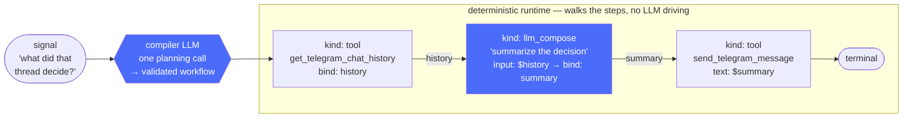
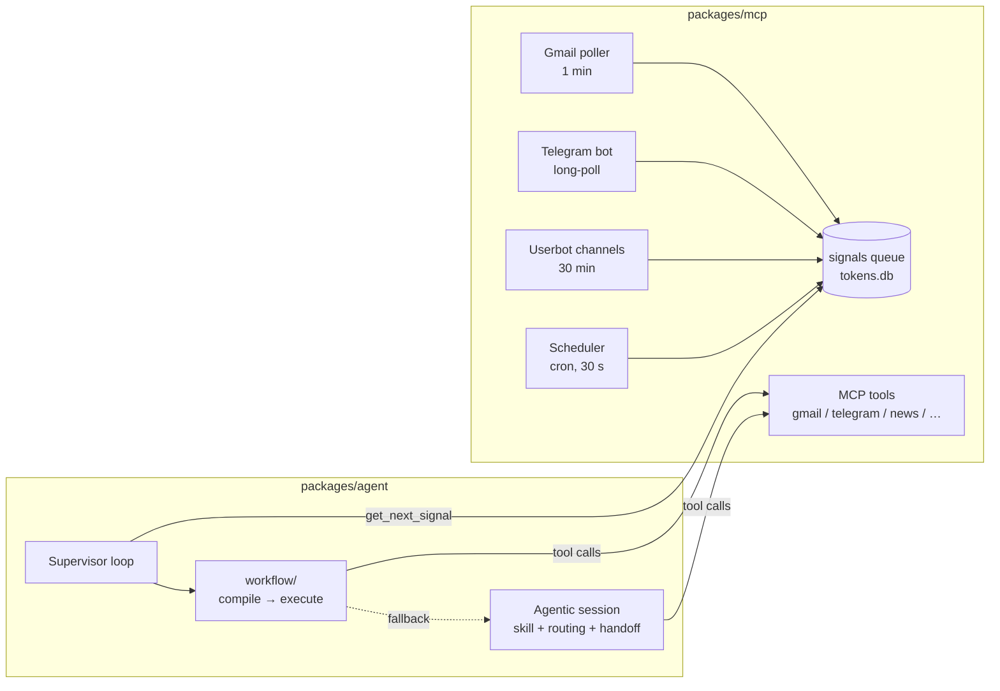

# Helper agent

> A personal agent that reads your mail, watches your Telegram channels, tracks
> your bank feed — and acts on it. Built as two small processes talking strictly
> over the [Model Context Protocol](https://modelcontextprotocol.io).

[](#what-it-is)
[](#stack)
[](https://modelcontextprotocol.io)
[](#stack)
[](#stack)

> 🚧 **Work in progress** — a personal project under active development;
> interfaces and internals change frequently.

---

## What it is

A **signal-driven personal-agent system**. External events (a new email, a
Telegram message, a cron tick) become *signals* on a queue. A supervisor pulls
them one at a time, loads a matching markdown *skill*, and runs a single LLM
session whose every side effect — a Telegram reply, a scheduled task, a DB
write — is an MCP tool call.

Two independent processes in one pnpm workspace, deployed as two containers:

| Package | Role | Knows about |
| --- | --- | --- |
| **`packages/mcp`** | Stateless MCP server. Wraps Gmail / Telegram / Monobank / news as primitive tools; runs the pollers that turn external events into signals. | Nothing about the agent. |
| **`packages/agent`** | Agent supervisor. Pulls one signal, compiles a workflow (or falls back to an agentic session), runs it, stops. | Nothing about MCP internals — only the tools the protocol exposes. |

Neither imports code from the other. The boundary *is* the protocol.

## ✨ Dynamic workflows: plan-then-execute instead of ReAct

The core engineering piece of this project. The naive way to run an LLM agent
is a **ReAct loop** — feed the model a prompt and tools, let it think-act-think
until it stops. It works, but it's opaque (the plan only exists implicitly in
the conversation history), unbounded (no limit on the number of model
round-trips), and every step pays the full context cost.

Here the supervisor inverts that: **one planning call compiles the signal into
a typed workflow, then a deterministic runtime executes it.**

What the compiler emits for *"what did that Telegram thread decide?"* — and
how the runtime walks it:



LLM calls are the two blue nodes — everything else is plain code: the
runtime dispatches tools, resolves `${bindings}`, and never re-asks the
model what to do next.

The DSL (`packages/agent/src/workflow/dsl.ts`) has six step kinds — `tool`,
`llm_compose`, `llm_agent` (a *bounded* ReAct sub-loop with a tool whitelist
and `maxIterations`), `parallel`, `terminal`, `replan` — and deliberately **no
branching or loops**. Design decisions that make it hold up in practice:

- **Hallucinated tools die at compile time.** The Zod schema is built at
  engine boot from the live MCP tool registry and skill list — tool and skill
  names are closed enums, so a typo or invented tool is a validation error,
  not a runtime crash.
- **Validation errors feed a retry loop.** Zod issues are flattened to
  one-line `at steps[2].tool: …` messages and handed back to the compiler —
  cheap, and first-retry success is high precisely because the errors are
  readable.
- **Explicit data flow.** Steps publish results via `bind` and reference them
  with `${path.to.value}` placeholders; each LLM step sees *only* the bindings
  it names — the inverse of the grow-forever conversation-history model.
- **`replan` instead of `if`.** When the plan depends on data the model hasn't
  seen ("can't decide until I read X"), it emits a gather-workflow ending in
  `replan` with named bindings; the runtime recompiles with that context. The
  plan→act→replan loop is bounded by `maxPasses`, so a planner that never
  commits degrades cleanly instead of looping forever.
- **Failure routing is a discriminated union.** A `compile` failure is safe —
  nothing ran — so the supervisor degrades to a classic agentic session. An
  `execute` failure means side effects may have already fired, so it is
  reported to the user instead of silently retried.
- **Every pass is traced.** Compile attempts, step execution, and sub-LLM
  calls all land in Langfuse as one tree per signal, with an LLM-as-judge
  pipeline (`pnpm judge`) scoring trajectories offline.

The payoff: most signals run as a handful of cheap, parallelizable,
individually-traced steps — and the free-form agent is the *fallback*, not
the default.

## How a signal becomes action



1. A poller notices something new and calls `recordSignal({ source, content, envContext })` —
   one row in the `signals` queue.
2. The supervisor (`packages/agent/src/supervisor/main.ts`) loops on
   `get_next_signal`.
3. A popped signal first goes through the
   [**dynamic-workflow module**](#-dynamic-workflows-plan-then-execute-instead-of-react)
   (`workflow/compile.ts` → `workflow/execute.ts`): the LLM compiles the
   signal into a validated step DSL, and a deterministic runtime walks the
   steps.
4. If compilation isn't possible, the **agentic fallback** kicks in: load
   `skills/<signal.source>.md` (plus `routing.md` and `handoff.md`), push the
   signal content as the first user message, and let DeepSeek drive — every
   side effect is a tool call.

**Adding a new domain = dropping a `skills.default/<name>.md` and emitting
signals with `source=<name>`.** No supervisor change.

## Skills

Markdown prompts, two-layered: `skills.default/` is git-tracked and shipped in
the image; `skills/` is a gitignored live overlay (a Docker volume) that the
agent's `dreaming` skill rewrites when it self-revises. `readSkill(name)`
checks the overlay first.

Skills are named after signal sources — one per domain (bills, news digests,
Telegram chat, scheduled tasks, …) plus a few meta-skills: `routing` (always
loaded, delegates across domains), `planner`, `recovery`, and `dreaming`
(self-revision).

## MCP tools

Defined in `packages/mcp/src/tools/`. The agent calls them over StreamableHTTP;
locally they're also registered with Claude Code via `.mcp.json`. Grouped by
integration:

**Gmail** (mail + attachments) · **Telegram bot** (send/edit messages, chat
history) · **Telegram userbot** (read-only MTProto channel reading) ·
**Monobank** (transactions) · **News / RAG** (headlines, article fetch,
semantic `search_news` over HN + Habr + channel posts) · **PDF / files** ·
**Signals queue** · **Scheduler** (cron tasks) · **Env** (timezone)

## Layout

```
mcp-tools/
├── docker-compose.yml      three services: postgres + mcp + agent
├── skills.default/         shipped skills (git-tracked fallback)
├── skills/                 live overlay (gitignored; dreaming writes here)
└── packages/
    ├── mcp/src/
    │   ├── server.ts                pollers + HTTP/stdio transport
    │   ├── tools/                   MCP-exposed actions
    │   └── services/                gmail, telegram, monobank, scheduler,
    │                                news, pdf, signals, settings, embeddings
    └── agent/src/
        ├── supervisor/              poll loop + failure handling
        ├── workflow/                signal → DSL compile + deterministic execute
        ├── engine.ts, session.ts    DeepSeek runner + synthetic tools
        ├── mcp-client.ts            StreamableHTTP client
        ├── skills.ts                two-layer skill loader
        └── tracing/                 Langfuse adapter
```

Domain code follows a strict **modules + dependency-injection** discipline:
factory functions (`createXxxModule(deps)`), no singletons, composition root
in `server.ts main()`. See `services/news/module.ts` for the canonical shape,
and `CLAUDE.md` for the full rules.

## Stack

TypeScript (ESM) · [`@modelcontextprotocol/sdk`](https://github.com/modelcontextprotocol/typescript-sdk) ·
`better-sqlite3` · Drizzle + pgvector · `googleapis` (Gmail) ·
gramjs (MTProto userbot) · `cron-parser` · `openai` SDK pointed at DeepSeek ·
Langfuse tracing · Vitest.

## Getting started

```bash
pnpm install
pnpm db:init          # apply both sqlite schemas (idempotent)

# one-time credentials
pnpm gmail:auth       # Gmail OAuth → tokens.db
pnpm userbot:auth     # MTProto login (phone + code)
pnpm telegram:get-chat-id

# run (two terminals)
pnpm mcp:serve        # MCP server + pollers
pnpm agent:start      # supervisor loop
```

> ⚠️ Don't run `mcp:serve` locally while the production instance is up —
> Telegram `getUpdates` is exclusive; a second poller causes 409 Conflict
> and silently eats updates.

Env files: `.env.mcp` (integration creds + `OPENAI_API_KEY` for embeddings),
`.env.agent` (DeepSeek key + model), `.env.postgres` (PG credentials).
Examples are checked in as `*.example`.

### Useful scripts

| Command                                            | What it does                                             |
| -------------------------------------------------- | -------------------------------------------------------- |
| `pnpm typecheck`                                   | Typecheck both packages                                  |
| `pnpm test`                                        | Vitest suite                                             |
| `pnpm trace` / `pnpm judge`                        | Inspect Langfuse traces / run the LLM-as-judge over them |
| `pnpm eval:snapshot` · `eval:rag` · `eval:inspect` | RAG evaluation harness                                   |
| `pnpm embed:backfill`                              | Re-embed `news_items` rows left without embeddings       |
| `pnpm db:generate:pg`                              | Regenerate Drizzle migrations after schema edits         |

## Deploy

One image, three containers:

```bash
docker compose up -d --build
```

Named volumes (`mcp-data`, `mcp-storage`, `agent-data`, `agent-skills`,
`pg-data`) persist state across rebuilds.
ко
