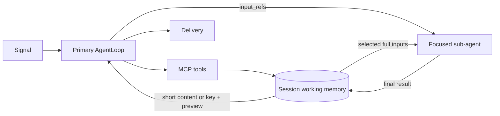
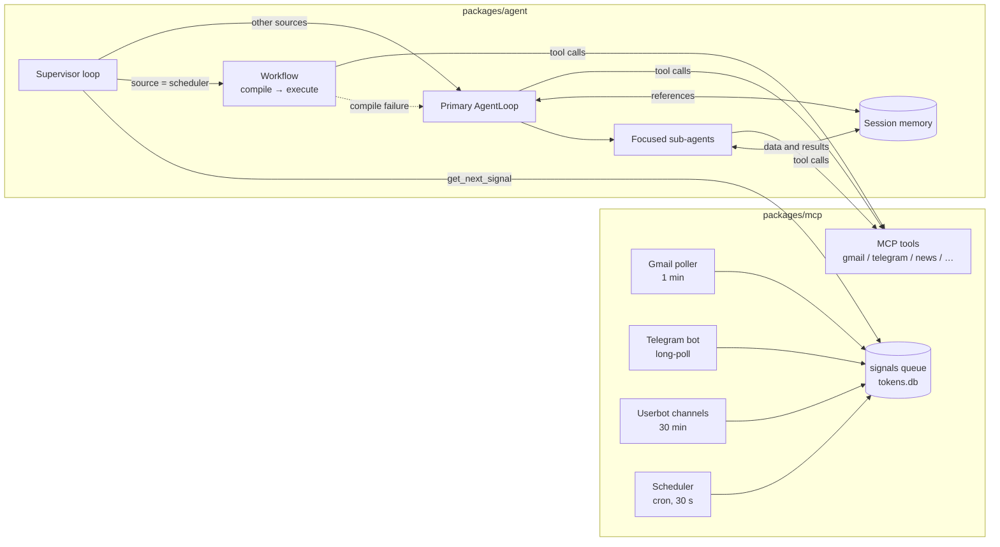

<p align="center">
  
</p>

<h1 align="center">Ouro helper</h1>

> A personal agent that reads your mail, watches your Telegram channels, tracks
> your bank feed — and acts on it. Built as two small processes talking strictly
> over the [Model Context Protocol](https://modelcontextprotocol.io).

<p align="center">
  <a href="#what-it-is"></a>
  <a href="#stack"></a>
  <a href="https://modelcontextprotocol.io"></a>
  <a href="#stack"></a>
  <a href="#stack"></a>
</p>

> 🚧 **Work in progress** — a personal project under active development;
> interfaces and internals change frequently.

---

## What it is

A **signal-driven personal-agent system**. External events (a new email, a
Telegram message, a cron tick) become *signals* on a queue. A supervisor pulls
them one at a time, loads a matching markdown *skill*, and runs a single LLM
session whose every side effect — a Telegram reply, a scheduled task, a DB
write — is an MCP tool call.

Two independent processes in one pnpm workspace, deployed as two containers:

| Package | Role | Knows about |
| --- | --- | --- |
| **`packages/mcp`** | Stateless MCP server. Wraps Gmail / Telegram / Monobank / news as primitive tools; runs the pollers that turn external events into signals. | Nothing about the agent. |
| **`packages/agent`** | Agent supervisor. Pulls one signal and runs a primary AgentLoop with shared working memory and focused sub-agents. | Nothing about MCP internals — only the tools the protocol exposes. |

Neither imports code from the other. The boundary *is* the protocol.

## AgentLoop and working memory

The primary agent handles each signal in a ReAct loop: call tools, observe
results and decide the next action. It can delegate several focused tasks
to sub-agents, each with a fresh conversation and the same session memory.
The primary uses the `smart` preset; workers choose a preset for their task.


```mermaid
flowchart LR
    S[Signal] --> A[Primary AgentLoop]
    A --> T[MCP tools]
    T --> M[(Session working memory)]
    M -->|short content or key + preview| A
    A -->|input_refs| W[Focused sub-agent]
    M -->|selected full inputs| W
    W -->|final result| M
    A --> D[Delivery]
```

Ordinary tool schemas and arguments stay unchanged. Runtime stores every
ordinary tool result under a fresh memory key. Results up to 8,000 UTF-8
bytes include full `content`; larger ones include a preview of at most 512
bytes. `working_memory_get` explicitly loads a full value into the calling
agent's context. `put`, `list` and `delete` manage the temporary string KV.
Memory operations return directly, without creating another stored copy.

`invoke_sub_agent` accepts `input_refs`: runtime loads those exact values
into the worker's user message without copying them into the parent's
history. Workers return full final answers normally; runtime decides whether
the parent sees their complete content or a memory reference. A worker cannot
spawn further workers. A general focused task can omit the optional `skills`.

The parent owns completion and delivery unless it explicitly assigns delivery
to a worker. Normal delivery calls take actual text; the parent can explicitly
read a result when needed. Dependent bookkeeping follows a successful send.
Temporary memory is shared through the task and its recovery, then released.
Persistent `set_memory` and MCP knowledge storage remain separate.

Each signal has one Langfuse trace and a local mirror. The primary loop,
LLM iterations (including usage), tools, memory references and nested workers
form a single observation tree. Full tool output stays in the tool span;
generation input records exactly the context that iteration saw. Recovery
is recorded in the same trace. Langfuse export uses the configured
`LANGFUSE_*` credentials; without them the local recorder still runs.

Routing is deterministic and by source, not by content. `scheduler` signals
are compiled into a workflow (`workflow/`: compile → execute) as before —
a cron body is known in advance, so a plan is cheaper and more predictable
than an agentic loop. Every other source runs the primary AgentLoop. A
scheduler signal whose plan fails to compile degrades to the AgentLoop in the
same trace; an execution failure is reported through recovery instead of being
retried, because earlier steps may already have delivered. The AgentLoop does
not expose a workflow tool.

For incoming `telegram` signals the supervisor loads recent history of the
same chat/topic before the first LLM turn (`supervisor/telegram-context.ts`):
a bounded inline excerpt plus the full fetched history under the
`telegram.history` memory key for `input_refs`. No other source preloads it,
and a failed fetch never blocks the reply.

## How a signal becomes action


```mermaid
flowchart LR
    subgraph mcp [packages/mcp]
        P1[Gmail poller<br/>1 min] --> Q
        P2[Telegram bot<br/>long-poll] --> Q
        P3[Userbot channels<br/>30 min] --> Q
        P4[Scheduler<br/>cron, 30 s] --> Q
        Q[(signals queue<br/>tokens.db)]
        T[MCP tools<br/>gmail / telegram / news / …]
    end

    subgraph agent [packages/agent]
        S[Supervisor loop] -->|get_next_signal| Q
        S -->|source = scheduler| W[Workflow<br/>compile → execute]
        S -->|other sources| L[Primary AgentLoop]
        W -.->|compile failure| L
        W -->|tool calls| T
        L --> C[Focused sub-agents]
        L <-->|references| M[(Session memory)]
        C <-->|data and results| M
        L -->|tool calls| T
        C -->|tool calls| T
    end
```

1. A poller notices something new and calls `recordSignal({ source, content, envContext })` —
   one row in the `signals` queue.
2. The supervisor (`packages/agent/src/supervisor/main.ts`) loops on
   `get_next_signal`.
3. `supervisor/module.ts` creates the session context and trace. A `scheduler`
   signal goes to the workflow runner (`planner` compiles the steps, the
   executor walks them); every other source starts the primary AgentLoop with
   `orchestrator` and `routing` instructions. Telegram signals also load their
   transport skill (and their recent chat history).
4. Domain work is delegated with the appropriate skill and memory references.
   The parent decides subsequent actions and delivers the result. On a fatal
   loop error, a bounded recovery agent reports the failure in the same session.

**Adding a new domain = dropping a `skills.default/<name>.md` and emitting
signals with `source=<name>`.** No supervisor change.

## Skills

Markdown prompts, two-layered: `skills.default/` is git-tracked and shipped in
the image; `skills/` is a gitignored live overlay (a Docker volume) that the
agent's `dreaming` skill rewrites when it self-revises. `readSkill(name)`
checks the overlay first.

Skills are named after signal sources — one per domain (bills, news digests,
Telegram chat, scheduled tasks, …) plus a few meta-skills: `routing` (always
loaded on the primary), `orchestrator`, `worker`, `recovery`, `planner`
(the workflow compiler's prompt, used for scheduler signals), and `dreaming`
(self-revision).

## MCP tools

Defined in `packages/mcp/src/tools/`. The agent calls them over StreamableHTTP;
locally they're also registered with Claude Code via `.mcp.json`. Grouped by
integration:

**Gmail** (mail + attachments) · **Telegram bot** (send/edit messages, chat
history) · **Telegram userbot** (read-only MTProto channel reading) ·
**Monobank** (transactions) · **News / RAG** (headlines, article fetch,
semantic `search_news` over HN + Habr + channel posts) · **PDF / files** ·
**Skills** (`list_skills`, `read_skill`) · **Unified memory** (projects of
markdown documents + facts, semantic `recall` across both, versioned
patch/revert) · **Signals queue** · **Scheduler** (cron tasks) · **Env**
(timezone)

## Layout

```
mcp-tools/
├── docker-compose.yml      three services: postgres + mcp + agent
├── skills.default/         shipped skills (git-tracked fallback)
├── skills/                 live overlay (gitignored; dreaming writes here)
└── packages/
    ├── mcp/src/
    │   ├── server.ts                pollers + HTTP/stdio transport
    │   ├── tools/                   MCP-exposed actions
    │   └── services/                gmail, telegram, monobank, scheduler,
    │                                news, pdf, signals, settings, embeddings
    └── agent/src/
        ├── supervisor/              poll loop + failure handling
        ├── workflow/                DSL compiler/executor (scheduler path)
        ├── engine.ts, session.ts    DeepSeek runner + synthetic tools
        ├── mcp-client.ts            StreamableHTTP client
        ├── skills.ts                two-layer skill loader
        └── tracing/                 Langfuse adapter
```

Domain code follows a strict **modules + dependency-injection** discipline:
factory functions (`createXxxModule(deps)`), no singletons, composition root
in `server.ts main()`. See `services/news/module.ts` for the canonical shape,
and `CLAUDE.md` for the full rules.

## Stack

TypeScript (ESM) · [`@modelcontextprotocol/sdk`](https://github.com/modelcontextprotocol/typescript-sdk) ·
`better-sqlite3` · Drizzle + pgvector · `googleapis` (Gmail) ·
gramjs (MTProto userbot) · `cron-parser` · `openai` SDK pointed at DeepSeek ·
Langfuse tracing · Vitest.

## Getting started

```bash
pnpm install
pnpm db:init          # apply both sqlite schemas (idempotent)

# one-time credentials
pnpm gmail:auth       # Gmail OAuth → tokens.db
pnpm userbot:auth     # MTProto login (phone + code)
pnpm telegram:get-chat-id

# run (two terminals)
pnpm mcp:serve        # MCP server + pollers
pnpm agent:start      # supervisor loop
```

> ⚠️ Don't run `mcp:serve` locally while the production instance is up —
> Telegram `getUpdates` is exclusive; a second poller causes 409 Conflict
> and silently eats updates.

Env files: `.env.mcp` (integration creds + `OPENAI_API_KEY` for embeddings),
`.env.agent` (DeepSeek key + model), `.env.postgres` (PG credentials).
Examples are checked in as `*.example`.

### Useful scripts

| Command                                            | What it does                                             |
| -------------------------------------------------- | -------------------------------------------------------- |
| `pnpm typecheck`                                   | Typecheck both packages                                  |
| `pnpm test`                                        | Vitest suite                                             |
| `pnpm trace` / `pnpm judge`                        | Inspect Langfuse traces / run the LLM-as-judge over them |
| `pnpm eval:snapshot` · `eval:rag` · `eval:inspect` | RAG evaluation harness                                   |
| `pnpm embed:backfill`                              | Re-embed `news_items` rows left without embeddings       |
| `pnpm db:generate:pg`                              | Regenerate Drizzle migrations after schema edits         |

## Deploy

One image, three containers:

```bash
docker compose up -d --build
```

Named volumes (`mcp-data`, `mcp-storage`, `agent-data`, `agent-skills`,
`pg-data`) persist state across rebuilds.
